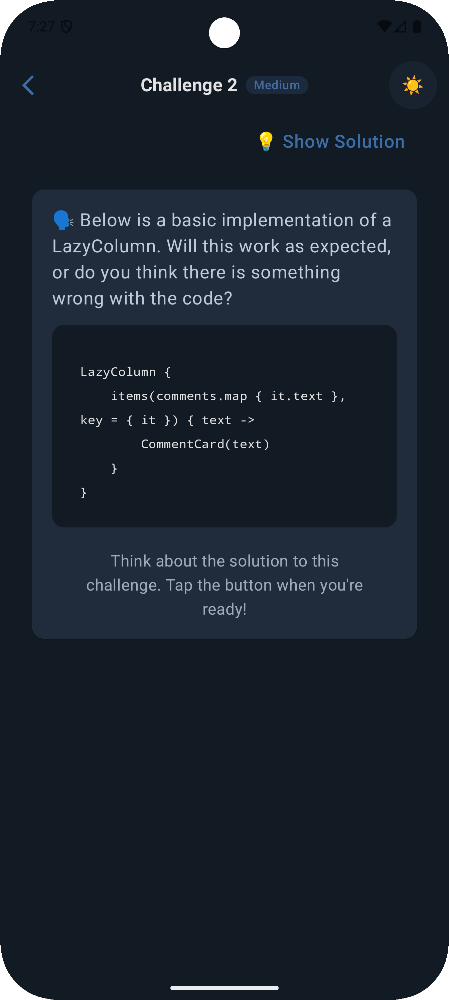
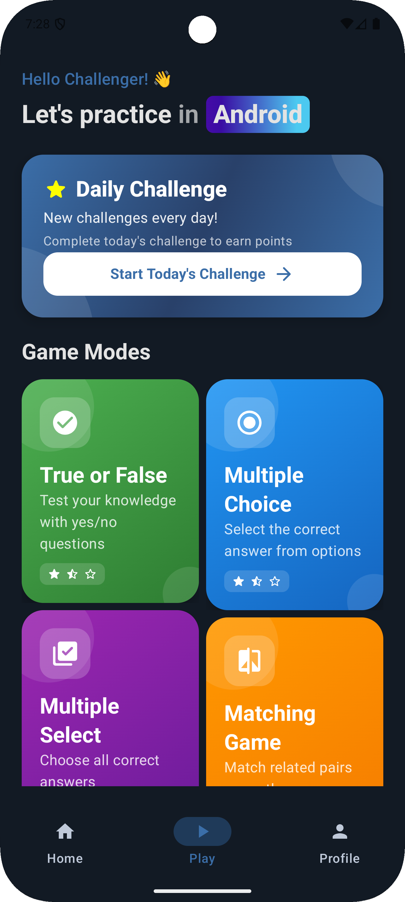
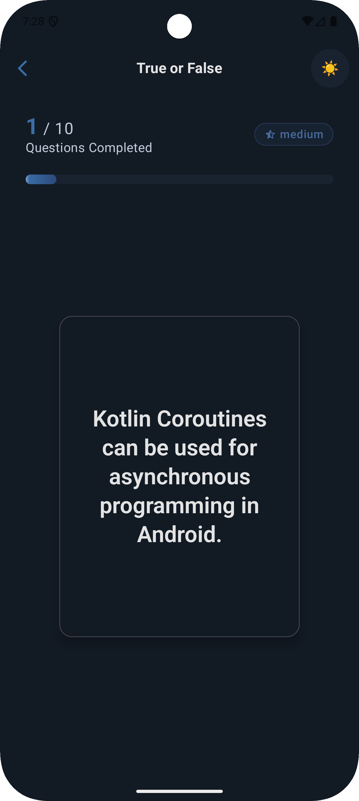
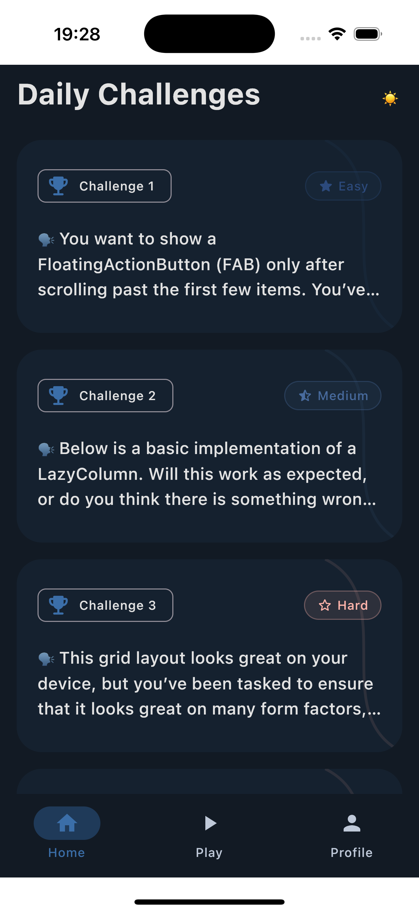
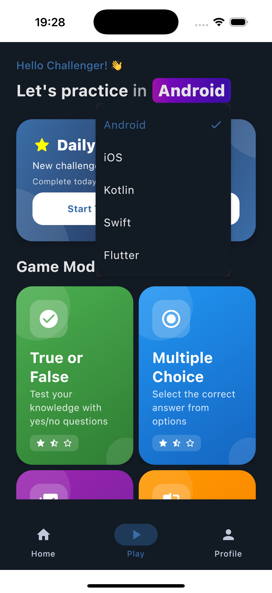
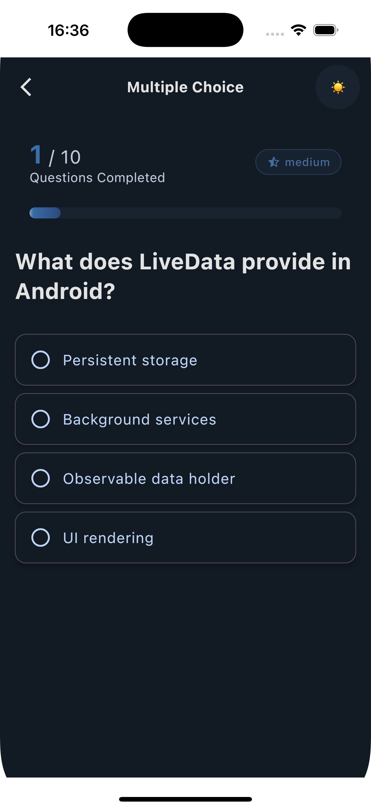
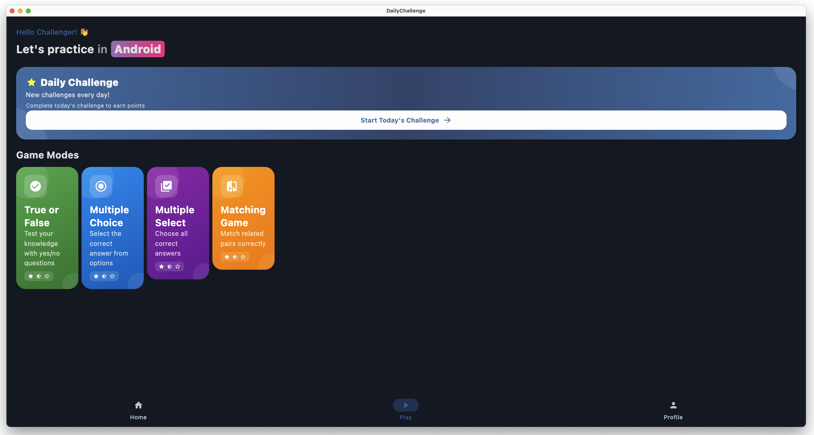
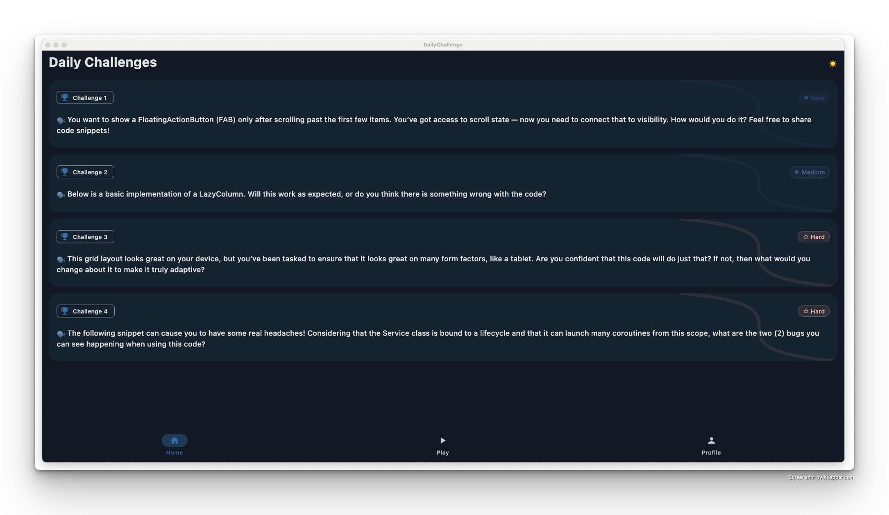
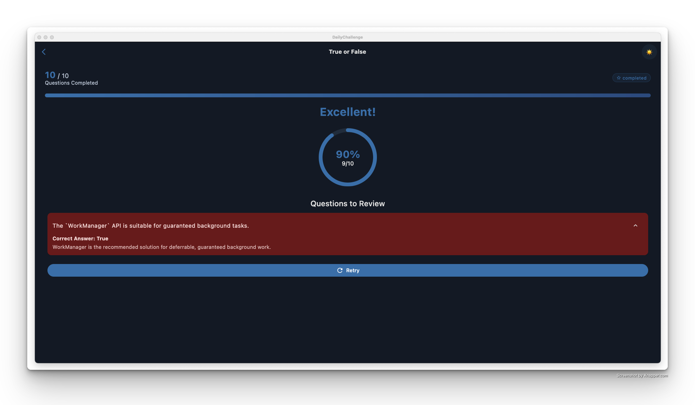

# Daily Challenge

A multiplatform app to browse and solve daily coding challenges. Built with Kotlin Multiplatform and
Compose for Android, iOS, Desktop, and Web.

## Screenshots

### Android Screenshots

<div align="center">
  
  
  
</div>

### iOS Screenshots

<div align="center">
  
  
  
</div>

### Desktop Screenshots

<div align="center">
  
  
  
</div>

---

## Download for Testing

You can download the latest Android APK for testing purposes from the link below:


  [Download Android APK](https://drive.google.com/file/d/1iVbWyTKYXIWb2e-VXF75y62iZJXG3-3m/view?usp=sharing)

  [Download Mac APP DMG](https://drive.google.com/file/d/1ncy1zSjszQ3zZQ8cXHABDZRgHl4-Jocq/view?usp=sharing)

---

## Tech Stack

### Core Technologies

- **Kotlin Multiplatform (KMP)** – Version `2.1.21`
- **Jetpack Compose Multiplatform** – Version `1.8.1`
- **Compose Hot Reload** – For development workflow enhancement

### Architecture & Design Patterns

- **MVVM Architecture** – Using `ViewModel` and state management
- **Navigation Component** – Jetpack Navigation Compose for routing
- **Koin** – Dependency injection (Version `4.0.0`)

### UI Framework

- **Compose Material 3** – For modern UI components
- **Adaptive UI** – For responsive design across platforms
- **Compose Navigation** – For screen navigation

### Data Management

- **DataStore** – Preferences storage (Version `1.1.7`)
- **Kotlinx Serialization** – JSON serialization (Version `1.7.3`)

### Image Loading

- **Coil** – Image loading and caching (Version `3.2.0`)

### Platform Support

- **Android** – Min SDK `24`, Target SDK `35`
- **iOS** – Native support via KMP
- **Desktop** – JVM-based desktop application
- **Web** – Configured for WebAssembly *(currently commented out. Looking for a solution with
  dataStore. That's why looking for contributors xD)*

### Other Libraries

- **Material Icons Extended** – For UI icons
- **Coroutines** – Asynchronous programming (Version `1.10.2`)

---

## Welcome for Contribution

I welcome contributions! You can add new challenge questions in any area—Android, Kotlin, Compose,
or even platform-specific topics. Help me grow the collection and make learning fun for everyone!

1. **Fork** the repository.
2. **Clone** your fork:
   ```sh
   git clone https://github.com/nyinyiz/DailyChallenge.git
   ```
3. **Create a new branch** for your feature or fix:
   ```sh
   git checkout -b my-new-challenge
   ```
4. **Add your challenge/question** or make your changes.
5. **Commit** and **push** your changes:
   ```sh
   git add .
   git commit -m "Add new challenge: [title]"
   git push origin my-new-challenge
   ```
6. **Open a Pull Request** on GitHub and describe your contribution.

## Contributing Challenge Questions

Thank you for considering contributing to Daily Challenge! Here's how you can add new challenge
questions.

### JSON File Structure

Challenge questions are stored in the `composeApp/src/commonMain/composeResources/files` directory.
There are three types of challenges:

1. Daily Challenges: `daily_challenges.json`
2. True/False Questions: `true_or_false_challenges_[category].json`
3. Multiple Choice Questions: `multiple_choice_challenges_[category].json`

where `[category]` can be: android, ios, kotlin, swift, or flutter

### JSON Format Examples

#### Daily Challenge Format

```json
{
  "id": "unique_id",
  "difficulty": "Easy|Medium|Hard",
  "question": "Your question text here",
  "questionCode": "Code snippet for the question (optional)",
  "answerCode": "Solution code snippet"
}
```

### True/False Challenge Format

```json
{
  "id": "unique_id",
  "question": "Your question text here",
  "correctAnswer": "true|false",
  "explanation": "Explanation text",
  "difficulty": "Easy|Medium|Hard"
}
```

### Multiple Choice Challenge Format

```json
{
  "question": "Your multiple choice question",
  "options": [
    "Option A",
    "Option B",
    "Option C",
    "Option D"
  ],
  "correctAnswer": "A|B|C|D",
  "explanation": "Explanation for the correct answer"
}
```

## 👤 Author

Created by **Nyi Nyi Zaw** (nyinyizaw.dev@gmail.com)
