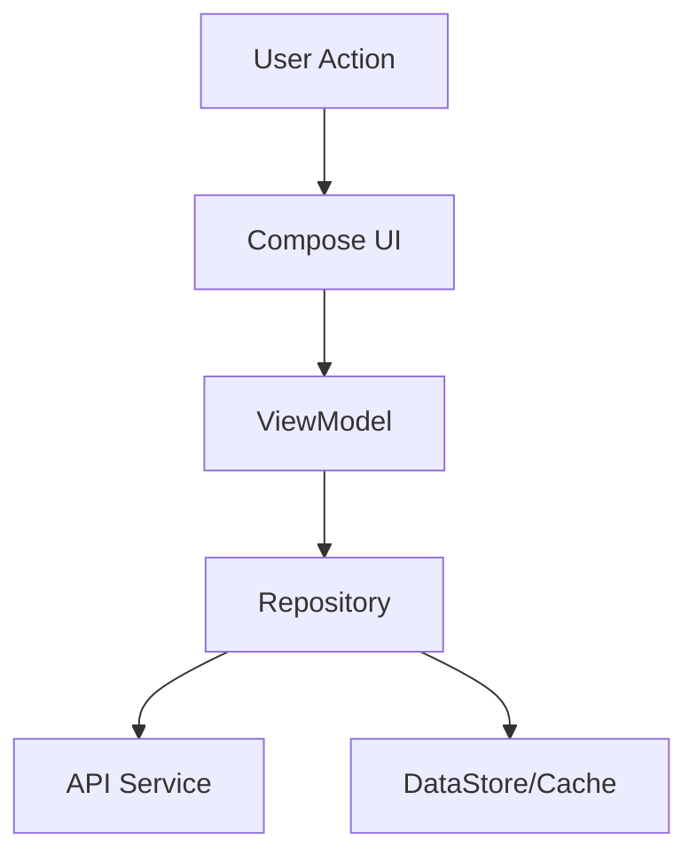

<div align="center">
  
  <h1>Daily Challenge</h1>
  <p>
    <a href="https://kotlinlang.org"></a>
    <a href="https://www.jetbrains.com/lp/compose-multiplatform/"></a>
    <a href="LICENSE"></a>
  </p>
  <p><strong>Master Mobile Development with Daily Coding Challenges</strong></p>
</div>

## 🚀 Overview

**Daily Challenge** is a Kotlin Multiplatform educational app designed to gamify learning for Android, iOS, and Desktop developers.

| 🤖 Android | 🍎 iOS | 🖥️ Desktop |
| :---: | :---: | :---: |
| Compose Multiplatform | Compose Multiplatform | Compose Multiplatform |

## ✨ Key Features

| Feature | Description |
| :--- | :--- |
| **🎮 Game Modes** | True/False, MCQ, Multi-Select, Matching |
| **📚 Categories** | Android, iOS, Kotlin, Swift, Flutter |
| **🔥 Daily Challenges** | Complex coding problems with solutions |
| **🌙 Theming** | Dark/Light mode support |
| **📶 Offline First** | Learn anywhere, anytime |

## Screenshots

### Android Screenshots

<div align="center">
  
  
  
</div>

### iOS Screenshots

<div align="center">
  
  
  
</div>

### Desktop Screenshots

<div align="center">
  
  
  
</div>

## 🏗️ Architecture



## 📚 Documentation

| Guide | Description |
| :--- | :--- |
| [**Project Intro**](docs/PROJECT_INTRO.md) | Goals, mission, and vision |
| [**Architecture**](docs/ARCHITECTURE.md) | MVVM, Clean Architecture, Koin |
| [**Tech Stack**](docs/TECH_STACK.md) | Libraries and tools used |
| [**Features**](docs/FEATURES.md) | Detailed feature breakdown |
| [**Setup**](docs/SETUP.md) | Installation and build guide |
| [**API Reference**](docs/API_REFERENCE.md) | API endpoints and data formats |

## ⚡ Quick Start

```bash
git clone https://github.com/nyinyiz/DailyChallenge.git
cd DailyChallenge
./gradlew composeApp:run
```

## 🤝 Contributing

Contributions are welcome! See [CONTRIBUTING.md](docs/CONTRIBUTING.md).

## 📄 License

This project is licensed under the [MIT License](LICENSE).
