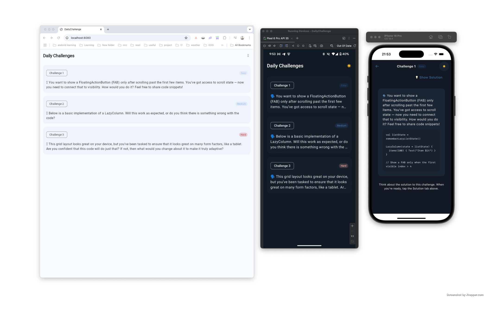

# Daily Challenge

A multiplatform app to browse and solve daily coding challenges. Built with Kotlin Multiplatform and Compose for Android, iOS, Desktop, and Web.

## Screenshots

<!-- Add your screenshots here -->


---

## Welcome for Contribution

We welcome contributions! You can add new challenge questions in any area—Android, Kotlin, Compose, or even platform-specific topics. Help us grow the collection and make learning fun for everyone!

1. **Fork** the repository.
2. **Clone** your fork:
   ```sh
   git clone https://github.com/your-username/daily-challenge.git
   ```
3. **Create a new branch** for your feature or fix:
   ```sh
   git checkout -b my-new-challenge
   ```
4. **Add your challenge/question** or make your changes.
5. **Commit** and **push** your changes:
   ```sh
   git add .
   git commit -m "Add new challenge: [title]"
   git push origin my-new-challenge
   ```
6. **Open a Pull Request** on GitHub and describe your contribution.

## 👤 Author

Created by **Nyi Nyi Zaw** (nyinyizaw.dev@gmail.com)