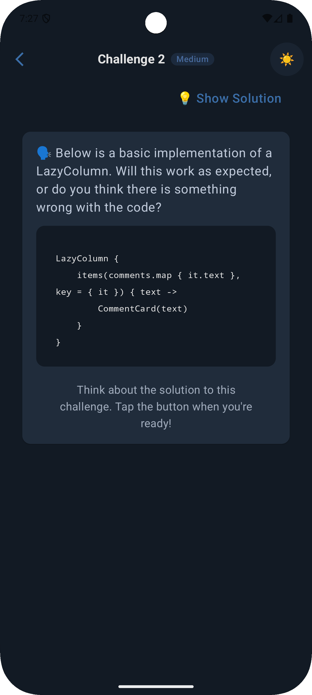
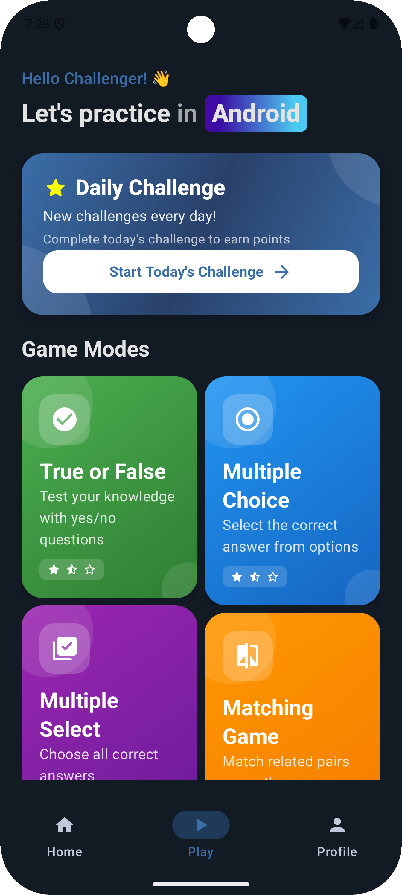
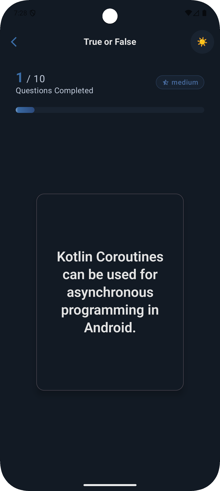
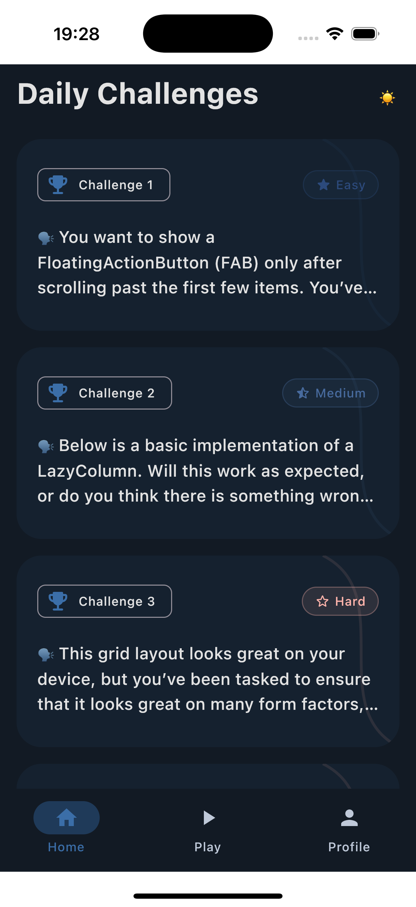
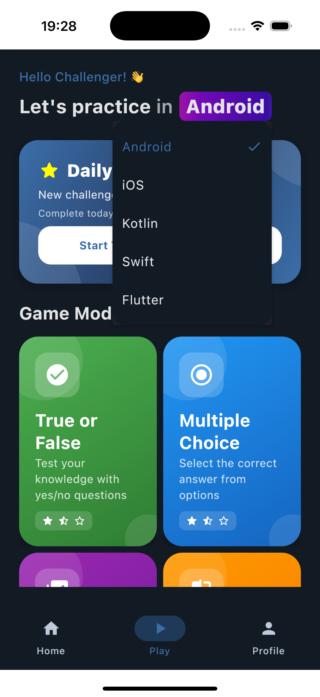
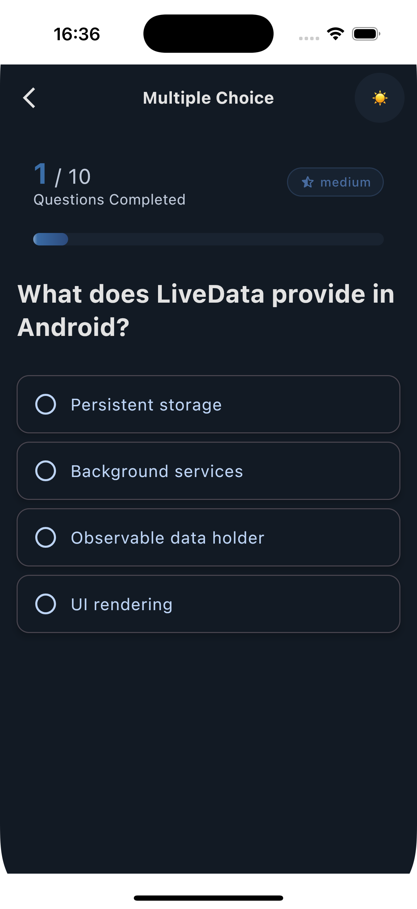
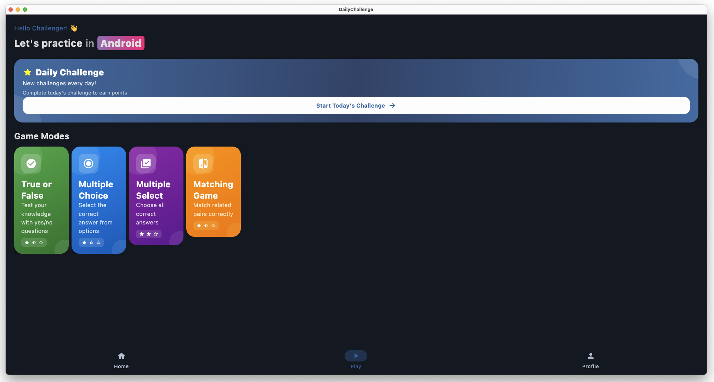
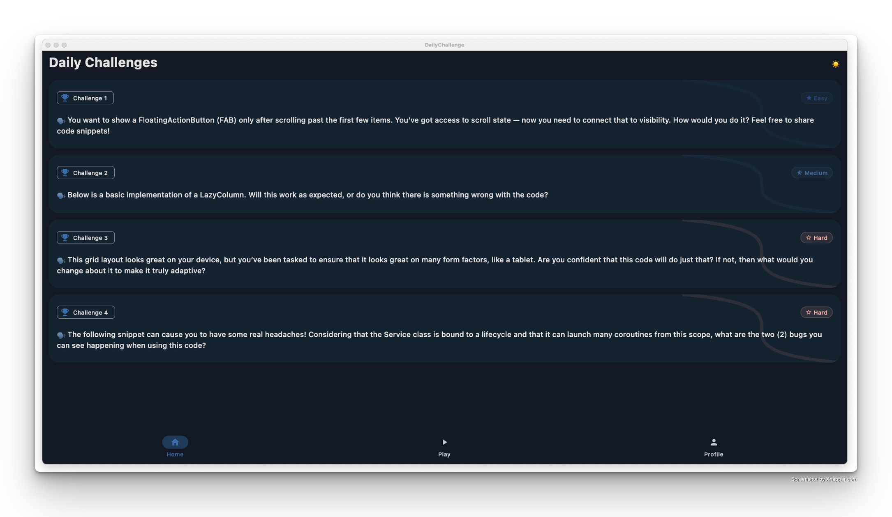
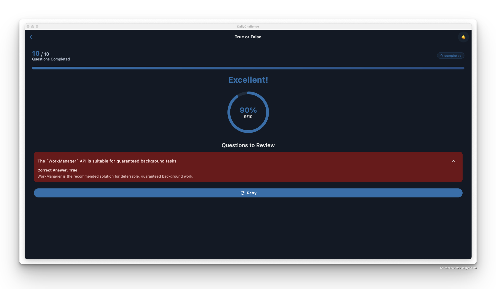
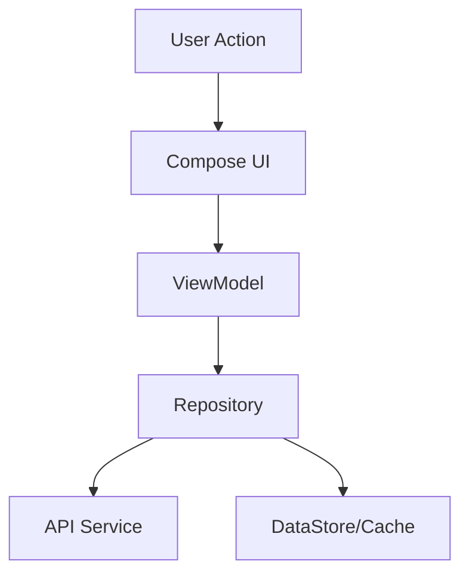

<div align="center">
  
  <h1>Daily Challenge</h1>
  <p>
    <a href="https://kotlinlang.org"></a>
    <a href="https://www.jetbrains.com/lp/compose-multiplatform/"></a>
    <a href="LICENSE"></a>
  </p>
  <p><strong>Master Mobile Development with Daily Coding Challenges</strong></p>
</div>

## 🚀 Overview

**Daily Challenge** is a Kotlin Multiplatform educational app designed to gamify learning for Android, iOS, and Desktop developers.

| 🤖 Android | 🍎 iOS | 🖥️ Desktop |
| :---: | :---: | :---: |
| Compose Multiplatform | Compose Multiplatform | Compose Multiplatform |

## Current Platform Status

The repository currently has active Gradle targets for:

- Android
- iOS
- Desktop (JVM)

The repository also contains `wasmJsMain` source files, but the `wasmJs` target is currently disabled in `composeApp/build.gradle.kts`. Web is therefore not part of the supported build baseline right now.

Current build baseline status:

- `:composeApp:test` passes
- `:composeApp:desktopTest` passes
- `:composeApp:assembleDebug` passes

Temporary Gradle note:

- this project currently uses the AGP 9 compatibility flags in `gradle.properties` (`android.builtInKotlin=false` and `android.newDsl=false`) so the existing single-module Kotlin Multiplatform + Android application setup continues to build
- this restores a stable baseline, but it is a compatibility bridge rather than the long-term project structure recommended by Kotlin Multiplatform

## ✨ Key Features

| Feature | Description |
| :--- | :--- |
| **🎮 Game Modes** | True/False, MCQ, Multi-Select, Matching |
| **📚 Categories** | Android, iOS, Kotlin, Swift, Flutter |
| **🔥 Daily Challenges** | Complex coding problems with solutions |
| **🌙 Theming** | Dark/Light mode support |
| **📶 Offline First** | Learn anywhere, anytime |

## Screenshots

### Android Screenshots

<div align="center">
  
  
  
</div>

### iOS Screenshots

<div align="center">
  
  
  
</div>

### Desktop Screenshots

<div align="center">
  
  
  
</div>

## 🏗️ Architecture


```mermaid
graph TD
    User[User Action] --> UI[Compose UI]
    UI --> VM[ViewModel]
    VM --> Repo[Repository]
    Repo --> Remote[API Service]
    Repo --> Local[DataStore/Cache]
```

## ⚡ Quick Start

```bash
git clone https://github.com/nyinyiz/DailyChallenge.git
cd DailyChallenge
./gradlew composeApp:run
```

## Build Baseline

Phase 0 baseline verification should use the currently supported targets only:

```bash
./gradlew :composeApp:test
./gradlew :composeApp:assembleDebug
./gradlew :composeApp:desktopTest
```

Notes:

- `:composeApp:test` validates the current unit-test baseline.
- `:composeApp:assembleDebug` validates the Android module wiring.
- `:composeApp:desktopTest` validates the current desktop test baseline.
- Web tasks are intentionally excluded because the web target is currently disabled.

## 🤝 Contributing

Contributions are welcome! See [CONTRIBUTING.md](docs/CONTRIBUTING.md).

## 📄 License

This project is licensed under the [MIT License](LICENSE).
