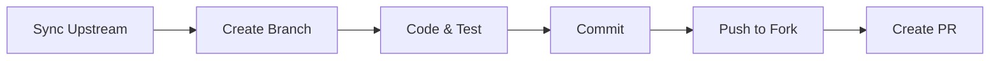

# Contributing Guidelines

Thank you for contributing to **Daily Challenge**! 🚀

## 🌟 Ways to Contribute

| Type | Description |
| :--- | :--- |
| **💻 Code** | Fix bugs, add features, optimize performance |
| **🧩 Content** | Add challenges, quizzes, and tips |
| **📝 Docs** | Improve guides, tutorials, and translations |
| **🎨 Design** | UI/UX improvements, assets, themes |
| **🧪 QA** | Test app, report bugs, verify fixes |

## 🚀 Getting Started

### Prerequisites

| Tool | Version | Note |
| :--- | :--- | :--- |
| **Android Studio** | Ladybug+ | For Android/KMP |
| **JDK** | 17+ | Required |
| **Xcode** | 14+ | For iOS (macOS only) |

### Quick Setup

```bash
# 1. Fork & Clone
git clone https://github.com/YOUR_USERNAME/DailyChallenge.git
cd DailyChallenge

# 2. Add Upstream
git remote add upstream https://github.com/nyinyiz/DailyChallenge.git

# 3. Create Branch
git checkout -b feature/amazing-feature
```

## 🛠️ Development Workflow



### Common Commands

```bash
# Run Android App
./gradlew :composeApp:assembleDebug

# Run Tests
./gradlew test

# Format Code
./gradlew ktlintFormat
```

## 📝 Code Style

We follow [Kotlin Coding Conventions](https://kotlinlang.org/docs/coding-conventions.html).

```kotlin
// Example: ViewModel
class FeatureViewModel(
    private val repository: FeatureRepository
) : ViewModel() {
    
    private val _uiState = MutableStateFlow<UiState>(UiState.Loading)
    val uiState = _uiState.asStateFlow()

    fun loadData() {
        viewModelScope.launch {
            // Implementation
        }
    }
}
```

## 🧩 Contributing Challenges

Questions are stored in [daily_challenges_data](https://github.com/nyinyiz/daily_challenges_data).

| Category | File Pattern | Example |
| :--- | :--- | :--- |
| **Daily** | `daily_challenges.json` | Coding problems |
| **Quiz** | `true_or_false_challenges_{cat}.json` | T/F questions |
| **MCQ** | `multiple_choice_challenges_{cat}.json` | Multiple choice |

### Quality Checklist
- [ ] Accurate & Verified
- [ ] Clear Question
- [ ] Educational Explanation
- [ ] Valid JSON

## 📮 Pull Requests

1. **Descriptive Title**: `feat: add dark mode`
2. **Clear Description**: What changed and why?
3. **Screenshots**: For UI changes
4. **Tests**: Ensure tests pass

## 📄 License

By contributing, you agree that your contributions will be licensed under the **MIT License**.

---

**Questions?** Contact [nyinyizaw.dev@gmail.com](mailto:nyinyizaw.dev@gmail.com)
